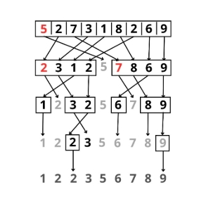

```md
# Algoritmo Quicksort


## 1. Inicio
El algoritmo comienza con una lista de números desordenados.

### Ejemplo 

**Lista inicial:**
```
`[5, 2, 7, 3, 1, 8, 2, 6, 9] `


## Paso 1: Elección del pivote y partición
Aquí se elige como pivote el primer elemento (en este caso, **8**), aunque en otras variantes se puede elegir el último o incluso uno aleatorio.

**Pivote = 5 (el primer elemento).**

### Pseudocódigo:
```
Algoritmo quicksort(lista, primer_elemento, ultimo_elemento) 
    i = primer_elemento 
    j = ultimo_elemento 
    pivote = lista[primer_elemento]
```
Se dividen los elementos en dos grupos:

- **Menores que 5:** `[2, 3, 1, 2]`
- **Mayores o iguales que 5:** `[7, 8, 6, 9]`

### Pseudocódigo:
```
Mientras i < j 
    Mientras lista[i] < pivote 
        i = i + 1 
    Fin Mientras 

    Mientras lista[j] > pivote 
        j = j - 1 
    Fin Mientras 
```

---
## Paso 2: Aplicar recursión a cada sublista

### Sublista izquierda `[2, 3, 1, 2]`
- **Pivote seleccionado:** 2
- **Menores que 2:** `[1]`
- **Mayores o iguales que 2:** `[3, 2]`

### Sublista `[4, 1, 5, 2]`
- **Pivote seleccionado:** 4
- **Menores que 4:** `[2, 1]`
- **Mayores o iguales que 4:** `[5]`

### Sublista derecha `[7, 8, 6, 9]`
- **Pivote seleccionado:** 7
- **Menores que 7:** `[6]`
- **Mayores o iguales que 7:** `[8, 9]`

Estas sublistas se siguen dividiendo recursivamente hasta que cada una tenga uno o cero elementos.


## Paso 3: Reunir todas las sublistas
Al finalizar, se combinan todas las sublistas ordenadas:

1. **Unir las sublistas de la izquierda (menores).**
2. **Colocar el pivote en su posición.**
3. **Agregar los elementos de la sublista derecha (mayores).**


